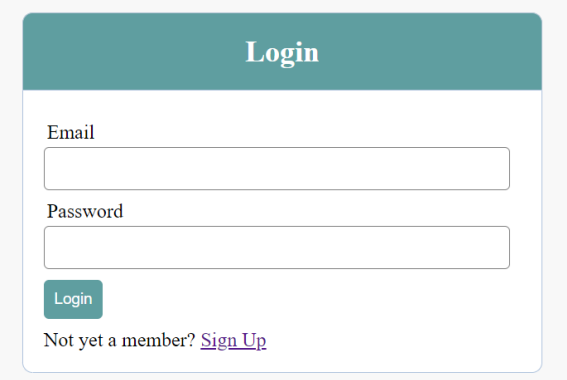
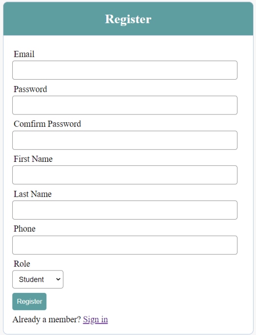
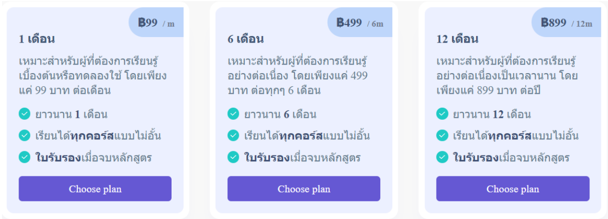
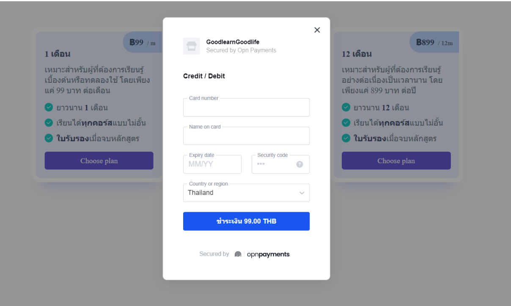
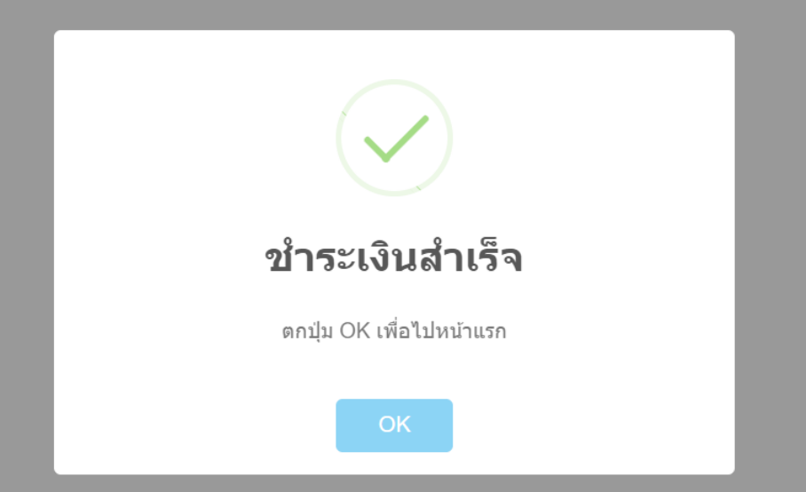
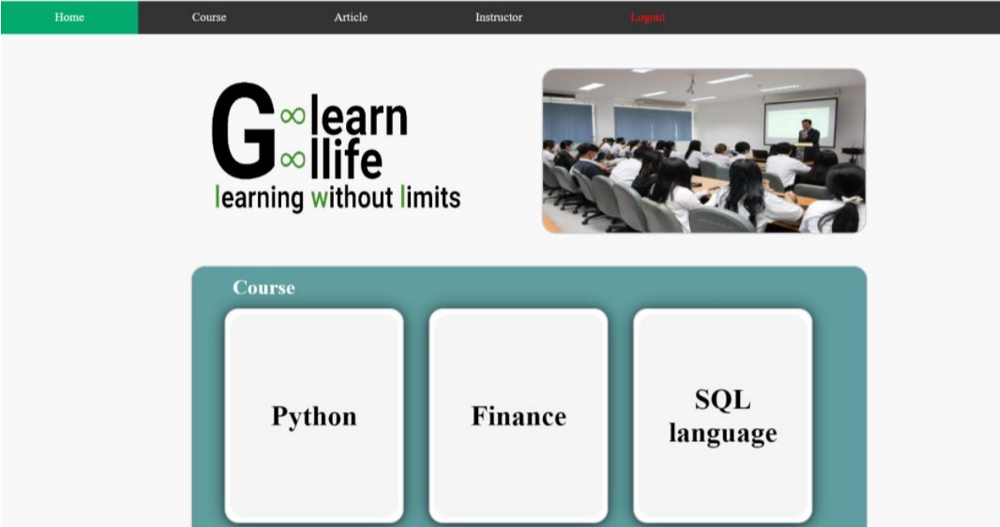
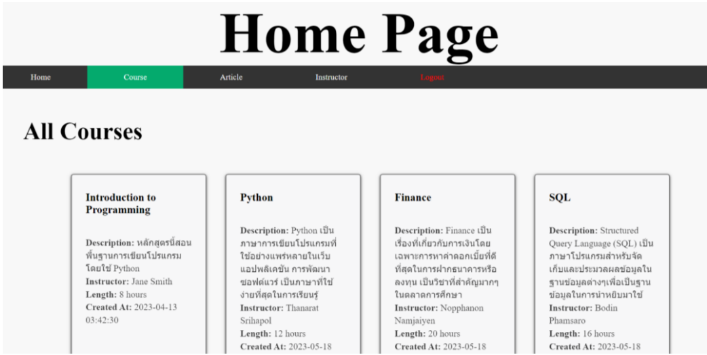
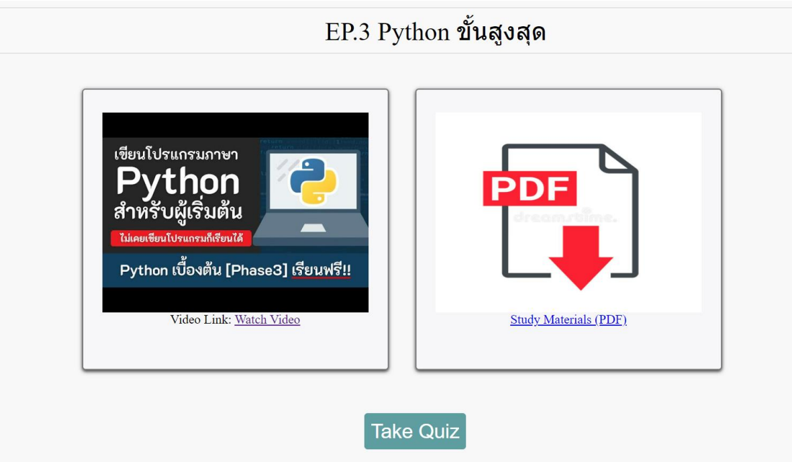

# 1. E-Testing App
## 🧰 Tech Stack

- **Frontend:** React, Semantic UI  
- **Backend:** Node.js, Express.js (microservices-based)  
- **Database:** MySQL, Sequelize ORM  
- **Admin Panel:** AdminJS with custom resource configurations  
- **Authentication:** JWT-based login system  
- **Features:** Progressive Web App (PWA), Responsive Design for mobile and desktop  

Source code (Work in Progress): https://github.com/Thanarat-DS/E-Testing-App

## Login
Uses JSON Web Token (JWT) to secure user login.  
</img>

## Home Page
Example list of quizzes. Each department has different topics (mock data shown).  
</img>

## Quiz
Example quiz with a countdown timer (mock data shown).  
</img>

## Result
Exam result page shown after completing all questions.  
</img>

## Admin
Includes a backend page for admin to manage and edit data.  
</img>

## Admin Edit Database
Example of user data.  
</img>

## Custom Admin Page
The system allows for creating more advanced custom components.  
Report page with an overview. Clicking the quiz code navigates and filters for editing.  
</img>  
Quiz configuration page.  
</img>

# 2. C# Backend Challenge
source code: https://github.com/Thanarat-DS/BackendChallenge

## 🧰 Tech Stack

- **Backend:** ASP.NET Core 8.0 (Web API)  
- **Authentication:** ASP.NET Identity with JWT (JSON Web Token)  
- **Database:** SQLite  
- **ORM:** Entity Framework Core  

## API Endpoint Summary

| Method | Endpoint       | Description                                                  | Request Body Example                                |
|--------|----------------|--------------------------------------------------------------|-----------------------------------------------------|
| POST   | `/login`       | Authenticate user and return JWT token                       | `{ "username": "xxx", "password": "xxxx" }`         |
| POST   | `/register`    | Create new user account                                      | `{ "username": "xxx", "password": "xxxx", "fullname": "xxx" }` |
| GET    | `/books`       | Get book list from ITBook API and sort by title              | –                                                   |
| POST   | `/user/like`   | Like a book and save to database                             | `{ "user_id": "xxx", "book_id": 1 }`                |

# 3. Artesian Map And Farm Analysis App

source code: https://github.com/Thanarat-DS/MapAppProject

## Overview

Interactive mapping application to visualize farmland, artesian wells, and aquifer layers. Built with React, it allows users to search farmland plots and discover nearby water resources with spatial analysis tools.

## 🧰 Tech Stack

- **Frontend:** React, Leaflet, Semantic UI  
- **Data Cleaning:** Python  
- **Data Visualization:** React-Leaflet (Map), Custom popups and markers  

## Features

- View clustered data on an interactive map.  
- Search by plot ID to find artesian wells within a 2 km radius.  
- Hover over data points to:  
  - See well details.  
  - Identify aquifer layers.  
  - Get direction and distance from selected farmland.  

## Data Sources

1. **Farm Data:** Randomly generated for demonstration.  
2. **Artesian Wells:** Open data from Thai Government.  
3. **Aquifer Layers:** Open data from the Thai Department of Water Resources.  

## UI Snapshots

**Home Page**  

**Zoom-in View with Clustering**  

**Plot Search with Nearby Wells Highlighted**  

# 4. E-Learning Website (Project from KMITL University)

source code: https://github.com/Thanarat-DS/E-LearningWeb

## 🧰 Tech Stack

- **Frontend:** HTML, CSS  
- **Backend:** PHP  
- **Database:** MySQL  
- **Features:** API Payment Gateway  

## Login  
</img>

## Register  
Separates roles between instructor and student.  
</img>

## Payment Plan  
</img>

## Payment Enter Credit Card  
</img>

## Success Payment  
</img>

## Home Page  
</img>

## Home Page (continued)  
</img>

## Courses List  
</img>

## In Course  
</img>

# 5. LittleLemon API (Django Backend Challenge)

source code: https://github.com/Thanarat-DS/LittleLemon-API-Project

## 🧰 Tech Stack

- **Backend:** Django REST Framework  
- **Authentication:** Token-based authentication using Djoser (JWT)  
- **Database:** SQLite  
- **User Roles & Permissions:** Role-based access (`admin`, `manager`, `delivery crew`, `customer`)  
- **API Features:**  
  - User registration and login  
  - Role/group management for admin and managers  
  - Menu and category CRUD for managers  
  - Cart and order system for customers  
  - Order assignment and tracking for delivery crew  
- **Pagination, Filtering & Sorting:** Implemented for menu items  
- **Admin Panel:** Django Admin  

<!-- The rest of the content remains unchanged as it was already in English -->
