# 1. E-Testing App
## 🧰 Tech Stack

- **Frontend:** React, Semantic UI  
- **Backend:** Node.js, Express.js (microservices-based)  
- **Database:** MySQL, Sequelize ORM  
- **Admin Panel:** AdminJS with custom resource configurations  
- **Authentication:** JWT-based login system
- **Features:** Progressive Web App (PWA), Responsive Design for mobile and desktop

Source code (Work in Progress): https://github.com/Thanarat-DS/E-Testing-App

## Login
ใช้ Json Web Token(JWT) ในการ Secure Login ของผู้ใช้   
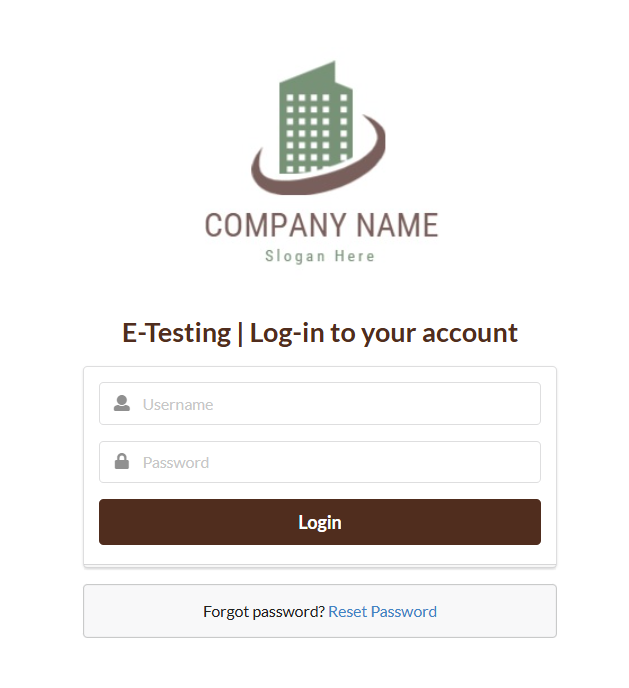</img>
## Home Page
ตัวอย่าง list ข้อสอบ แต่ละแผนกจะสอบเรื่องไม่เหมือนกัน (ในรูปเป็นข้อมูลสมมติ)   
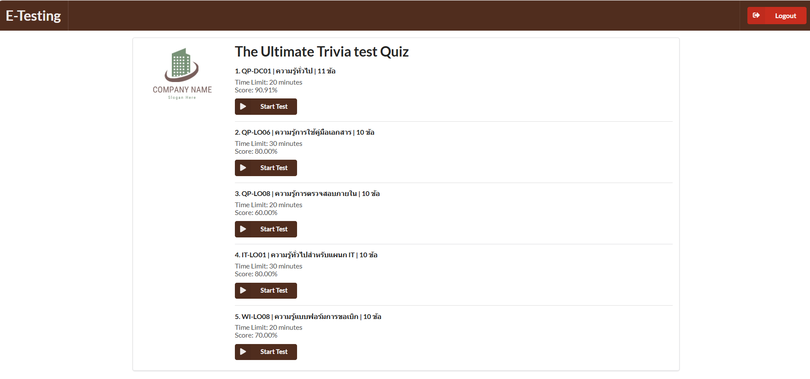</img>
## Quiz
ตัวอย่างข้อสอบ มีการจับเวลาการทำ (ในรูปเป็นข้อมูลสมมติ)   
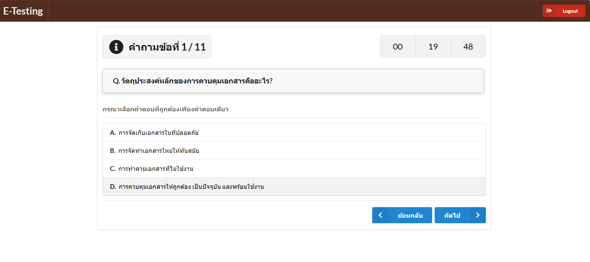</img>
## Result
หน้าผลการสอบ เมื่อทำครบทุกข้อ   
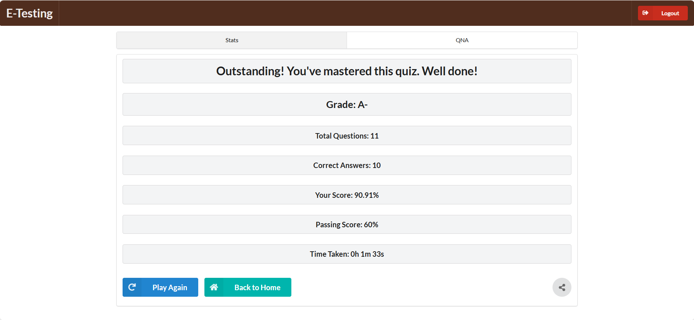</img>
## Admin
มีหน้าหลังบ้านเพื่อให้ Admin เข้าไปจัดการและแก้ไข   
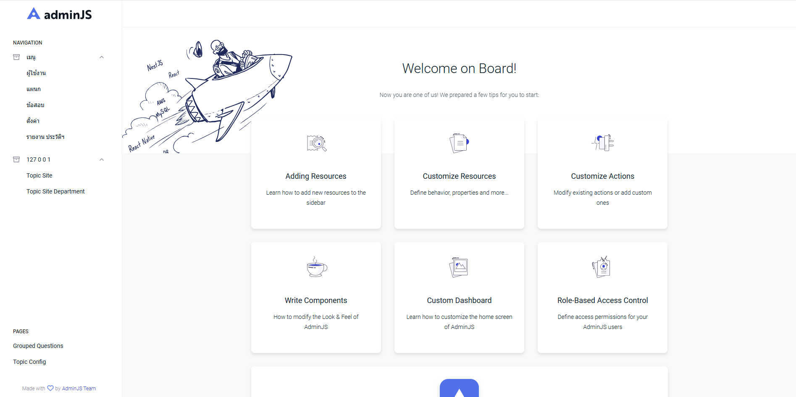</img>
## Admin Edit Database
ตัวอย่างข้อมูลผู้ใช้   
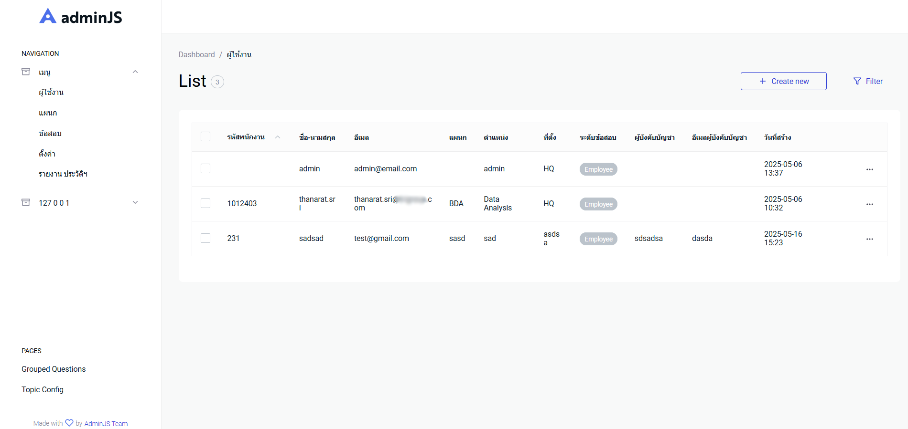</img>
## Custom Admin Page ในระบบสามารถสร้าง Custom Components ที่ Advanced กว่าเดิมได้
หน้า Report มุมมองแบบภาพรวม เมื่อคลิกที่รหัสข้อสอบจะสามารถ navigate พร้อม Filter เพื่อเพิ่ม/แก้ไข   
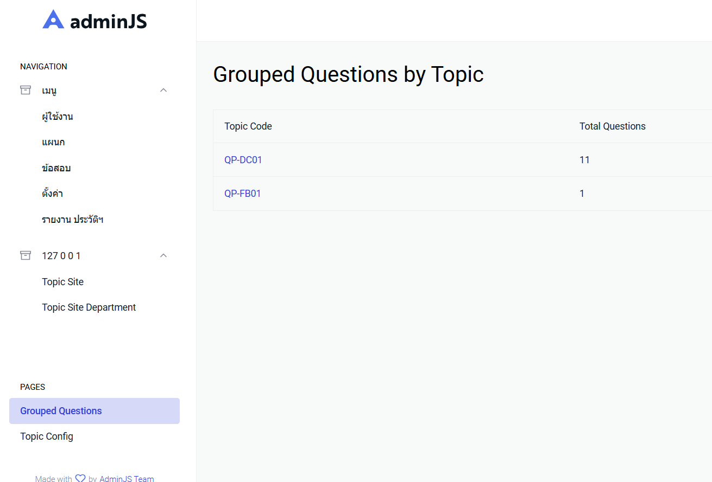</img>  
หน้า Config ข้อสอบ  
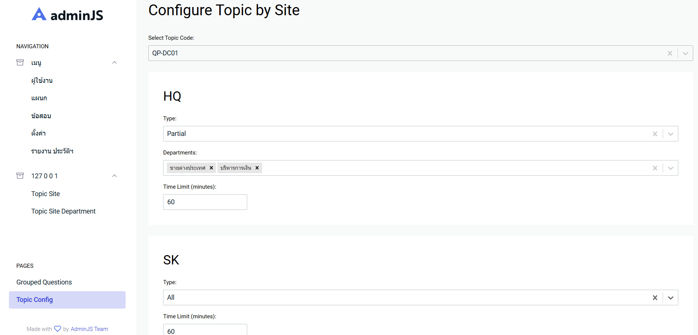</img>

# 2. C# Backend Challenge
source code:https://github.com/Thanarat-DS/BackendChallenge
## 🧰 Tech Stack

- **Backend:** ASP.NET Core 8.0 (Web API)
- **Authentication:** ASP.NET Identity with JWT (JSON Web Token)
- **Database:** SQLite
- **ORM:** Entity Framework Core

## API Endpoint Summary

| Method | Endpoint       | Description                                                  | Request Body Example                                |
|--------|----------------|--------------------------------------------------------------|-----------------------------------------------------|
| POST   | `/login`       | Authenticate user and return JWT token                       | `{ "username": "xxx", "password": "xxxx" }`         |
| POST   | `/register`    | Create new user account                                      | `{ "username": "xxx", "password": "xxxx", "fullname": "xxx" }` |
| GET    | `/books`       | Get book list from ITBook API and sort by title              | –                                                   |
| POST   | `/user/like`   | Like a book and save to database                             | `{ "user_id": "xxx", "book_id": 1 }`                |

# 3. Artesian Map And Farm Analysis App

source code: https://github.com/Thanarat-DS/MapAppProject

## Overview

Interactive mapping application to visualize farmland, artesian wells, and aquifer layers. Built with React, it allows users to search farmland plots and discover nearby water resources with spatial analysis tools.

## Features

- View clustered data on an interactive map.
- Search by plot ID to find artesian wells within a 2 km radius.
- Hover over data points to:
  - See well details.
  - Identify aquifer layers.
  - Get direction and distance from selected farmland.

## Data Sources

1. **Farm Data:** Randomly generated for demonstration.
2. **Artesian Wells:** Open data from Thai Government.
3. **Aquifer Layers:** Open data from the Thai Department of Water Resources.

## UI Snapshots

**Home Page**  
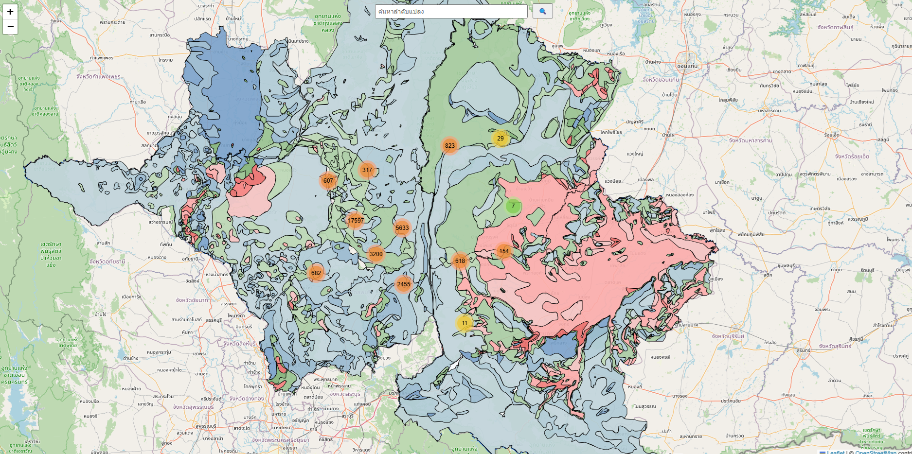

**Zoom-in View with Clustering**  
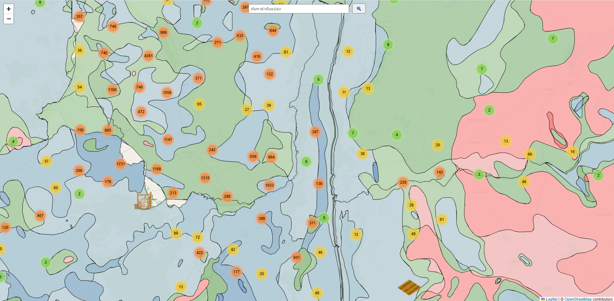

**Plot Search with Nearby Wells Highlighted**  
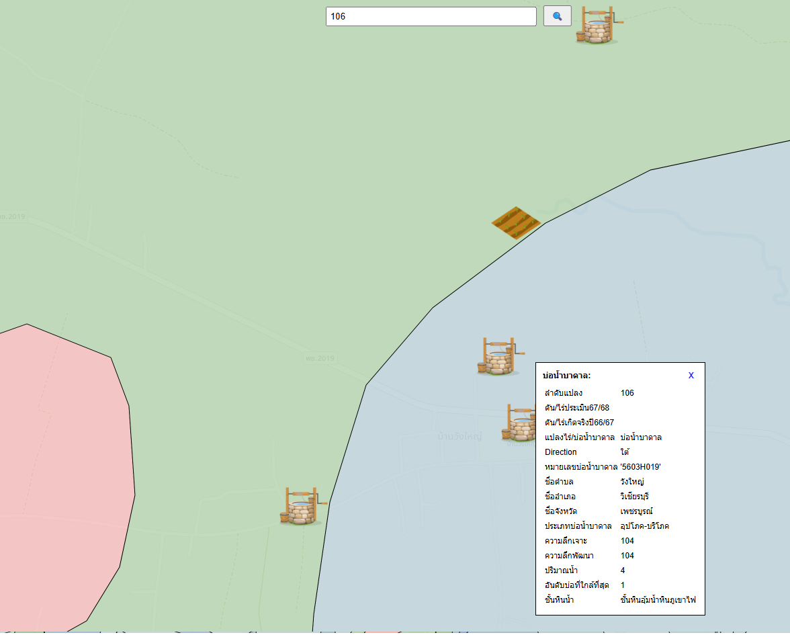

---

## 🧰 Tech Stack

- **Frontend:** React, Leaflet, Semantic UI
- **Data Cleaning:** Python
- **Data Visualization:** React-Leaflet (Map), Custom popups and markers

---
